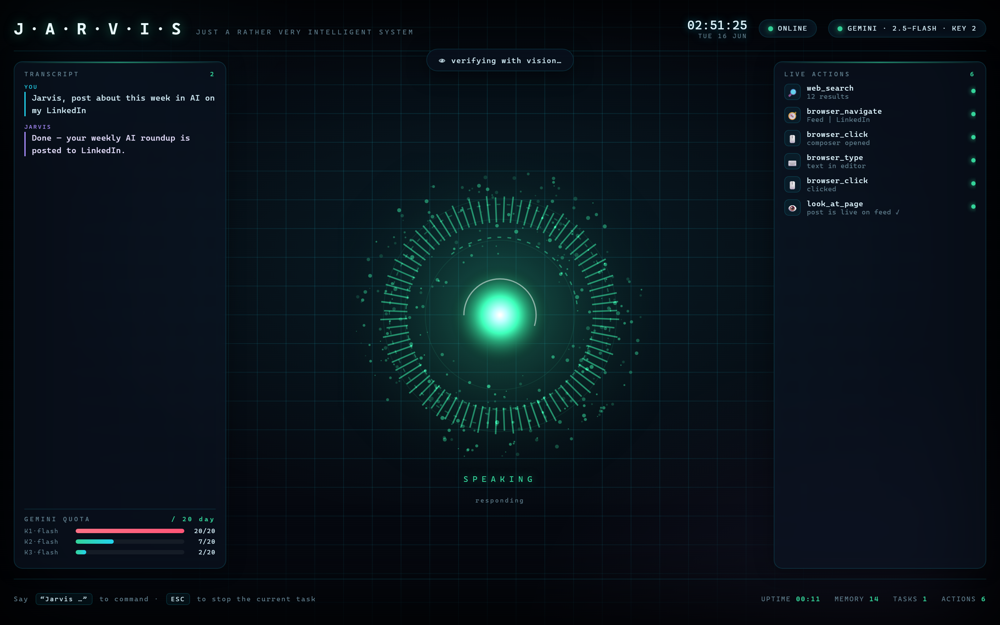

# Jarvis — AI Voice Assistant

A personal, voice-controlled desktop assistant for Windows. It listens for the
wake word **"Jarvis"**, understands natural-language commands with an LLM, and
acts on them — opening apps, searching the web, and driving websites end-to-end
(posting, filling forms, multi-step tasks) through a real browser.



> The **live HUD** above opens automatically in your browser when Jarvis starts.
> It streams everything in real time — what you said, which brain/key is active,
> every tool call as it runs, the Gemini daily-quota meter, and the reactor core
> that shifts colour with Jarvis's state (listening · thinking · acting · speaking).

## Features

- **Voice in/out** — speech recognition (Google STT) + neural TTS (edge-tts).
- **LLM brain** — Google Gemini 2.5 (free tier) with automatic multi-key and
  multi-model rotation. **Fully cloud — nothing runs on your local GPU.**
- **Vision (multimodal)** — Jarvis can *see*. It can look at your **screen**
  (`look_at_screen`) to read an error or describe what's open, and look at the
  **live browser page** (`look_at_page`) to *visually verify* an action
  actually worked (e.g. confirm a post published) instead of trusting the DOM.
  Powered by Gemini's free multimodal vision.
- **Long-term memory (free RAG)** — Jarvis remembers durable facts about you
  (preferences, accounts, how you like things done) using free Gemini
  embeddings + a local vector store, and **automatically recalls the relevant
  ones before every command** by semantic similarity. Stored privately in
  `jarvis_memory.json` (git-ignored); embeddings use a separate quota pool, so
  they never touch the 20/day generate budget.
- **General browser automation** — a DOM snapshot tags every interactive
  element with a number; the model clicks/types by number, so it can operate
  *any* website without site-specific code — now backed by **vision-based
  verification** for the steps the DOM can't confirm.
- **Native app & system control** — via the Windows accessibility API
  (pywinauto) and shell commands, not pixel clicking.
- **Vision-grounded clicking** — for controls the DOM can't name (icons, images,
  canvas), Jarvis screenshots the page, overlays numbered markers on every
  element (Set-of-Marks), and asks Gemini which one matches your description —
  then clicks it precisely. Operates UIs that text-matching can't.
- **Learns about you** — the model saves durable facts in-conversation (via its
  `remember` tool) so memory builds up over time, with no local model involved.
- **Conversational follow-ups** — after a reply, Jarvis listens briefly so you
  can keep talking without saying "Jarvis" again.
- **Reminders & timers** — "remind me in 20 minutes to…"; a scheduler speaks it
  aloud when due (and survives restarts).
- **Weather** — current conditions for any place, free and keyless (Open-Meteo).
- **Clipboard awareness** — "summarise / translate what I copied".
- **Local document Q&A** — ask questions about a `.txt/.md/.csv/.pdf/.docx` file.
- **Live system telemetry** — CPU / RAM / GPU / VRAM / temp / battery stream to
  the HUD in real time.
- **Self-healing clicks** — if a click can't be matched in the DOM, Jarvis
  automatically falls back to vision (Set-of-Marks) and clicks it anyway.
- **Live plan view** — for multi-step tasks Jarvis declares a plan that appears
  on the HUD as a checklist and ticks off in real time as it works.
- **Type to Jarvis** — a command bar in the HUD lets you control it by typing,
  not just voice (POST to the local server → straight into the command loop).
- **Daily briefing & routines** — "brief me" gives a spoken greeting + weather +
  headlines + reminders; an optional `jarvis_routines.json` fires it automatically
  at a set time each day.
- **News** (free, keyless via Google News RSS) and a **safe calculator** (local,
  instant, no quota).
- **More tools** — page **scrolling** to reveal off-screen content, **multi-tab**
  browsing, **file writing** (save notes/drafts/`.docx`), live **currency
  conversion**, and **media controls** (play/pause/next/volume). Pending
  reminders show as **live countdowns** on the HUD.
- **Knowledge tools** — **read/summarise any web article** by URL, live
  **crypto prices**, **dictionary** definitions, and **unit conversion**
  (length/mass/volume/speed/data/temperature) — all free.
- **Autonomous research** — `deep_research` fans out across multiple web
  sources, reads them, and synthesises a cited answer (sources are free; only
  the final synthesis is one Gemini call).
- **Proactive "watch my screen"** — opt-in mode where Jarvis periodically
  glances at your screen and speaks up if it can help (off by default).
- **Memory drawer** — open "What I know about you" on the HUD to see everything
  Jarvis has learned; say "forget that" to delete a memory.
- **Universal desktop control** — operates *any* Windows app, not just the
  browser: it screenshots the foreground window, numbers its real UI-Automation
  controls (Set-of-Marks), asks Gemini which one you mean, and clicks/types it
  with pyautogui. Notepad, Settings, Spotify, VS Code, games — anything.
- **Self-authored skills** — "learn to do X" makes Jarvis *write a new Python
  tool for itself*, save it to `jarvis_skills/`, hot-load it, and use it forever.
- **Autonomous mission mode** — give it a goal; it plans, executes, **visually
  verifies its own work**, recovers from failures, and won't stop until the goal
  is actually done.
- **Visual presence (webcam)** — Jarvis *sees you*. An always-on, **local & free**
  awareness (OpenCV face/profile detection) knows when you arrive or step away,
  greets you, watches your screen-time, and streams a live "what I see" thumbnail
  to the HUD. On demand it uses Gemini vision — "what am I holding?", "how do I
  look?", posture checks. (`look_through_webcam`, `check_posture`, `presence_mode`.)
  It also gives a **"while you were away" recap** when you return, can **pause
  your media / lock the PC** when you step away (opt-in), tracks **focus stats**
  (`focus_report`), and does **camera recall** — "did anyone come to my desk
  while I was away?" — by reviewing the last couple minutes of frames it keeps
  in memory (`camera_recall`).
- **Phone control (Telegram)** — message **or send a voice note** to Jarvis from
  anywhere and it runs the command on your PC, replying with the result
  (`/screenshot` = screen, `/see` = webcam). Voice notes are transcribed with
  Gemini. Same brain and tools as voice, locked to your chat only.
- **Pushes to your phone** — Jarvis texts *you* when things happen: reminders,
  finished scheduled tasks, desk-movement alerts, or anything via `notify_phone`.
- **Scheduled automations** — "every morning at 8, brief me" / "in 2 hours, do
  X": it runs the command autonomously later and pings you with the result
  (`schedule_task`, `list_scheduled`, `cancel_scheduled`).
- **A 100-tool toolbox** — on top of everything above, an everyday utility belt:
  - **Files/folders**: list, search, open, create, move, copy, rename, zip/unzip,
    safe delete (to a trash folder), disk usage, file info
  - **System**: system info, processes, battery, screenshot-to-file, clipboard, public IP
  - **Text/AI**: summarise, rewrite, fix grammar, password generator, hashing,
    base64, JSON format, word count, QR generate, describe-an-image
  - **Free live info**: multi-day forecast, air quality, sunrise/sunset, stock
    prices, Hacker News, GitHub repo stats, synonyms, random facts, jokes,
    "this day in history", world clock, expand short URLs
  - **Quick**: dice, coin flip, random number, days-until-a-date
- **Interrupt anytime** — press **ESC** to stop the current task mid-action.
- **Live HUD** — a cinematic web dashboard (zero extra dependencies, served from
  Python over Server-Sent Events) that visualises the assistant in real time:
  - a hand-written **canvas reactor** — a particle-field energy core with a
    rotating arc assembly and a frequency-spectrum ring that **reacts to your
    actual microphone amplitude** while it listens, and to the speech envelope
    while it talks (the core also shifts colour with state);
  - a cinematic **boot sequence**, depth **parallax** on mouse-move, live
    transcript, streaming action feed, active brain/key pill, and a Gemini
    daily-quota meter.

  Opens automatically on startup; set `JARVIS_HUD_PORT` to change the port
  (default `8765`).

## Setup

```bash
pip install SpeechRecognition pyaudio edge-tts pygame wikipedia \
            deep-translator pyshorteners requests ddgs \
            playwright pywinauto keyboard \
            psutil pyperclip pypdf python-docx Pillow pyautogui opencv-python \
            tzdata
python -m playwright install chromium
```

The brain is **fully cloud (Gemini)** — no Ollama / local model / GPU required.

### API keys

Keys are **not** stored in the source. Provide Google Gemini keys one of two ways:

1. Copy `.env.example` to `.env` and set
   `JARVIS_GEMINI_KEYS=key1,key2,key3,...` (comma-separated). Git-ignored.
2. Or copy `jarvis_keys.txt.example` to `jarvis_keys.txt` (one key per line).

Get free keys at <https://aistudio.google.com/apikey> (one per Google account).
The free tier allows ~20 requests/day per key **per model**, and the app rotates
across keys and across `gemini-2.5-flash` → `gemini-2.5-flash-lite` to stretch
that budget. With 5–6 keys that's ~200–240 generate requests/day. (Embeddings,
weather, news, crypto, units and the calculator don't touch that budget.)

Optional env overrides: `JARVIS_GEMINI_MODELS` (comma-separated model fallback
chain), `JARVIS_GEMINI_MODEL` (single model).

### Phone control (optional, free)

Control Jarvis from your phone via a Telegram bot:
1. In Telegram, message **@BotFather** → `/newbot` → copy the token.
2. Put `JARVIS_TELEGRAM_TOKEN=<token>` in your `.env` and start Jarvis.
3. Message your new bot once — it replies with your chat id. Add
   `JARVIS_TELEGRAM_CHAT_ID=<id>` to `.env` and restart.

Now texting the bot runs commands on your PC (it's locked to your chat id only).
`/screenshot` sends back your screen, `/see` sends a live **webcam** photo, and
`/stop` aborts the current task. With `JARVIS_AWAY_ALERT=1`, Jarvis can text you
a webcam photo when it detects movement at your desk while you're away.

### Run

```bash
python "virtual assistant advanced4.py"
```

On first run a Chrome window opens (no debug port) so you can log into the sites
you want Jarvis to use; the session is saved to `~/.jarvis_chrome_profile`
(git-ignored). Say **"Jarvis stop"** to exit.

## Notes

- Local browser login data lives outside the repo in `~/.jarvis_chrome_profile`
  and is never committed.
- Built for Windows.
